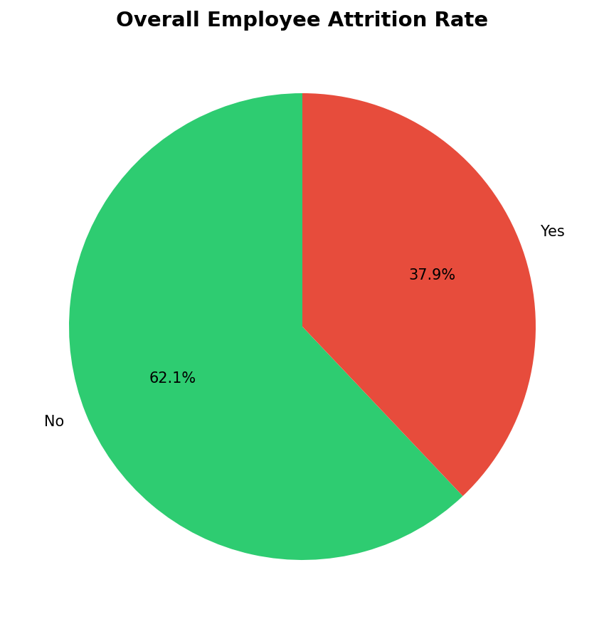
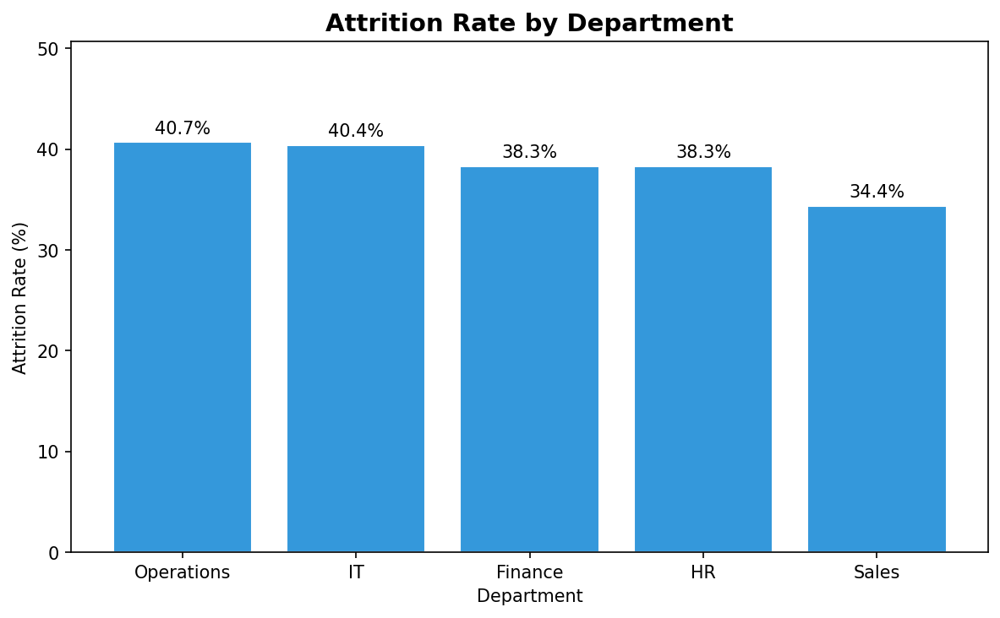
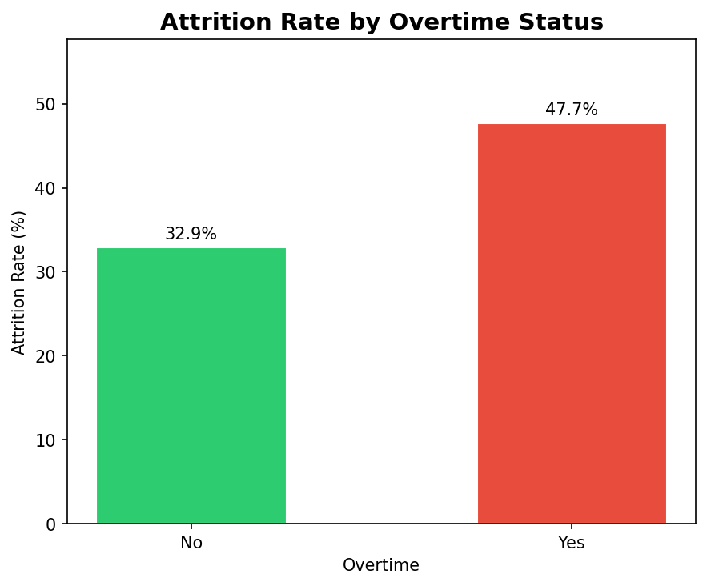
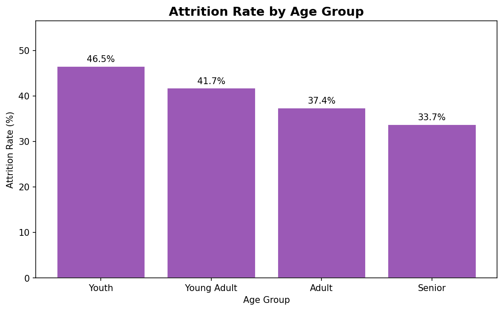
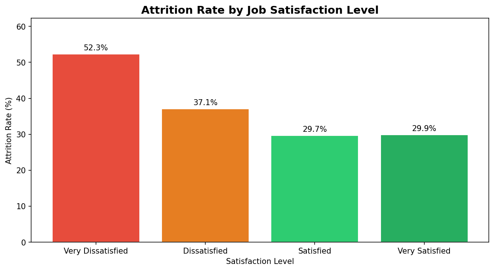
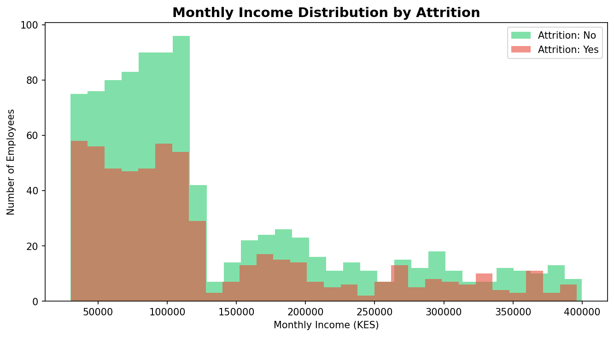
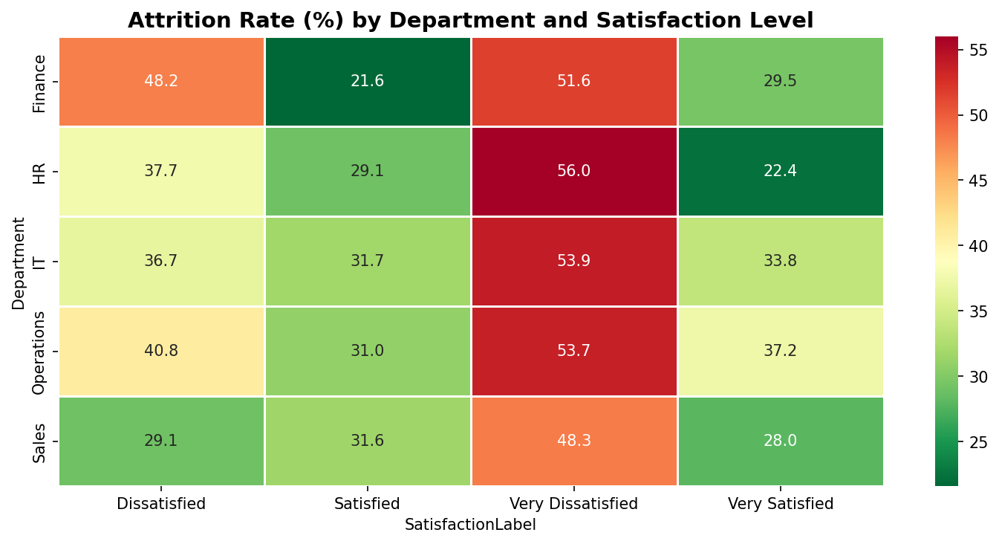

# hr-attrition-analysis
# HR Employee Attrition Analysis

An end-to-end data analysis project examining employee 
attrition patterns across 1,500 employees in a 
multi-department organisation. This project identifies 
the key drivers of attrition and provides actionable 
retention recommendations for the HR department.

**Author:** Christopher John  
**Tools:** Python (Pandas, Matplotlib, Seaborn) | SQL (SQLite)  
**Dataset:** 1,500 employees | 15 variables  

---

## Business Questions

1. What is the overall attrition rate and which department 
   has the highest?
2. Does overtime significantly increase attrition risk?
3. Which job role has the highest attrition rate?
4. Do younger employees leave more than older ones?
5. Is there a relationship between monthly income and attrition?
6. Does job satisfaction predict attrition?
7. Does distance from home affect attrition?
8. Do employees who work overtime AND have low satisfaction 
   leave at a higher rate?
9. How does work-life balance relate to attrition?
10. What is the profile of the employee most likely to leave?

---

## Tools Used

- **Python** — Pandas for data manipulation, Matplotlib 
  and Seaborn for visualisation
- **SQL** — SQLite via Python for query-based validation 
  and advanced profiling
- **Jupyter Notebook** — End-to-end analysis environment
- **GitHub** — Version control and portfolio documentation

---

## Dataset Overview

| Column | Description |
|--------|-------------|
| EmployeeID | Unique identifier |
| Age | Employee age 22–60 |
| Gender | Male / Female |
| Department | Sales, IT, HR, Finance, Operations |
| JobRole | Specific role within department |
| YearsAtCompany | 0–20 years |
| MonthlyIncome | KES monthly salary |
| JobSatisfaction | 1–4 scale |
| WorkLifeBalance | 1–4 scale |
| OverTime | Yes / No |
| DistanceFromHome | Kilometres |
| NumCompaniesWorked | 0–9 |
| TrainingTimesLastYear | 0–6 |
| PerformanceRating | 1–4 |
| Attrition | Yes / No — target variable |

---

## Data Cleaning

| Check | Finding | Action Taken |
|-------|---------|--------------|
| Null values | 0 found | None required |
| Duplicate rows | 0 found | None required |
| Value ranges | All valid | None required |
| Text consistency | No anomalies | None required |

**Calculated columns added:**
- `AgeGroup` — Youth / Young Adult / Adult / Senior
- `IncomeBand` — Low / Mid / High / Executive
- `SatisfactionLabel` — Very Dissatisfied to Very Satisfied
- `DistanceCategory` — Near / Mid / Far

---

## Key Findings

| # | Finding | Key Number |
|---|---------|------------|
| 1 | Overall attrition rate | 37.9% — nearly 2 in 5 employees leaving |
| 2 | Operations has highest department attrition | 40.7% |
| 3 | Overtime employees leave at significantly higher rates | 47.7% vs 32.9% — 14.8pp gap |
| 4 | Youth employees have highest attrition | 46.5% — descends consistently with age |
| 5 | Very Dissatisfied employees leave at | 52.3% |
| 6 | Satisfied vs Very Satisfied gap | Only 0.2pp — negligible difference |
| 7 | Income is not the primary driver | Median gap of only KES 2,984 between leavers and stayers |
| 8 | Overtime + Low Satisfaction combined risk | 58.3% — 2.2x more likely to leave |
| 9 | Highest single risk profile | Operations Young Adults on overtime — 81.8% |
| 10 | IT overtime overrides satisfaction | 80% attrition even among Very Satisfied IT overtime workers |

---

## Business Recommendations

1. **Overtime Policy Review** — Cap overtime in Operations 
   and IT immediately. Young Adults working overtime in 
   these departments leave at 61–82%. Introduce compensatory 
   time off and mandatory overtime limits.

2. **Operations Young Adult Programme** — This profile has 
   the highest attrition at 81.8%. Assign dedicated mentors, 
   reduce workload pressure and create visible career 
   progression paths for employees under 35 in Operations.

3. **IT Retention Strategy** — Overtime completely overrides 
   satisfaction in IT. Salary increases will not help — 
   workload reduction is the only effective intervention 
   for this department.

4. **Dissatisfaction Early Warning System** — Very Dissatisfied 
   employees leave at 52.3%. Implement monthly pulse surveys 
   with mandatory manager response within 2 weeks for any 
   score of 1.

5. **Focus retention spend at the bottom** — Moving employees 
   from Satisfied to Very Satisfied produces only 0.2pp 
   retention improvement. Budget is better spent moving 
   Very Dissatisfied employees upward where the impact 
   is 22+ percentage points.

---

## Dashboard Preview








---

## How to Run

1. Clone this repository
2. Install required libraries:
```
pip install pandas numpy matplotlib seaborn
```
3. Open `notebooks/HR_Attrition_Final_Report.ipynb` 
   in Jupyter Notebook
4. Run all cells from top to bottom

---

## Project Structure
```
hr-attrition-analysis/
│
├── data/
│   ├── hr_attrition.csv
│   └── hr_attrition_clean.csv
│
├── notebooks/
│   └── HR_Attrition_Final_Report.ipynb
│
├── outputs/
│   ├── 01_overall_attrition.png
│   ├── 02_attrition_by_department.png
│   ├── 03_attrition_by_overtime.png
│   ├── 04_attrition_by_age.png
│   ├── 05_attrition_by_satisfaction.png
│   ├── 06_income_distribution.png
│   └── 07_heatmap_dept_satisfaction.png
│
└── README.md
```
